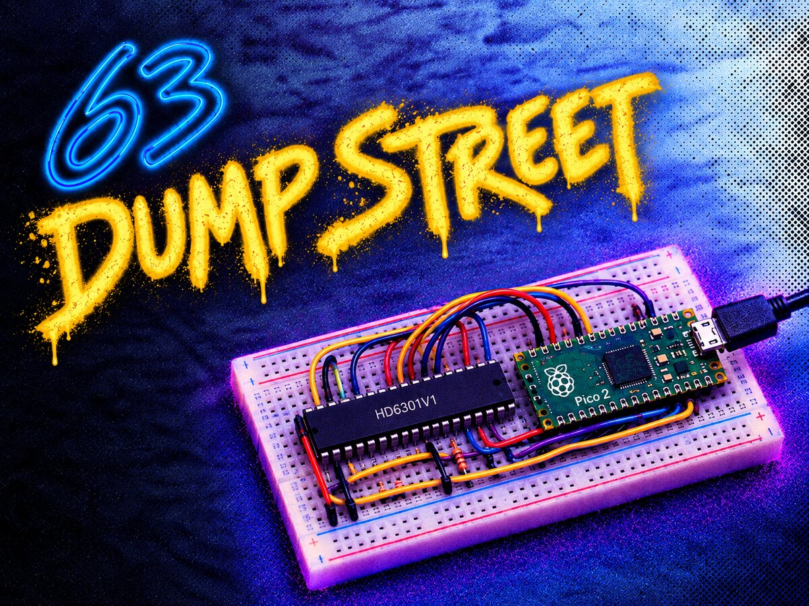
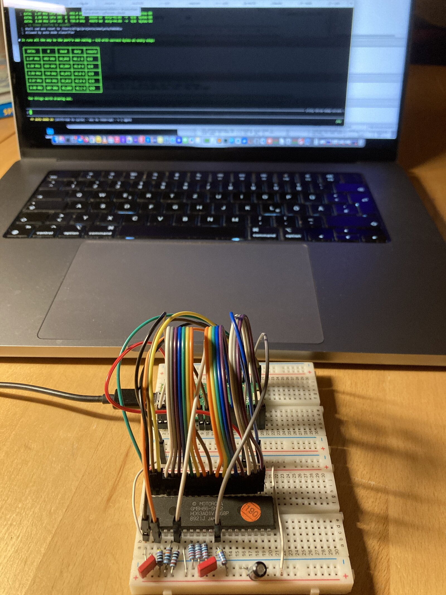

<p align="center">
  
</p>

# 63 Dump Street

Reading the internal mask ROM out of a Hitachi HD6301V1.

## Why

The Motorola MC micro radios are run by Hitachi 6301 and 6303 controllers. In the EVA5 (command board
GLN7059B) and the EVA9 (GLN6627A) the control program sits in an external
EPROM, so it can simply be replaced. That is what [MC70](http://mc70.stus-disco.de/)
does, and it turns the radio into a fully-fledged amateur radio transceiver.

The EZA9 (GLN6628B, GLN6984A) is the awkward one. There the program resides
within the controller, in mask ROM, and can therefore not be changed without
replacing the controller — which is why MC70 needs a whole CPU board for those
radios. The original firmware itself has never been available, because nobody
has read it out.

[MCprog](https://github.com/dg1yfe/MCprog) talks to these radios and MC70
replaces their firmware, but neither can look inside an EZA9's CPU. This
project does that for fun and (intellectual) profit ;) .

## The hardware

<p align="center">
  
</p>

Two breadboards, a Pico 2 and some jumper wire. The part under test is a Hitachi HD63A01V1G68P, mask 86-5M22 made for Motorola GmbH, in Japan in week 21 of 1989.

The dump reveals the chip coming from a Motorola MC Micro EZA9 model radio:

```
EZ9.00.02.03 Copr,1987 Motorola GmbH
```

The pull-ups and the two resistors on the lower board are not optional. The
wiring is described in [`pico2/README.md`](pico2/README.md).

## How it works

The HD6301V1 has 4 KB of internal mask ROM at `$F000–$FFFF` that is not exposed to the outside.
The way in is **mode 0** (multiplexed test), where the internal ROM stays enabled
but the reset vector at `$FFFE` is fetched *externally* for the first three or
four cycles after #RESET rises. This allows us to feed the part a reset vector and a program from outside,
and it will happily read its own ROM out and send it down a serial line.

That takes two halves, and this repository is both of them.

## The two parts

**`6301/` — the program the chip runs.** 31 bytes of HD6301 assembly at
`$C000`: bring up the SCI, send each byte from `$F000` to `$FFFF` using polled mode (TDRE),
then `SLP`. The program is written in a way it needs neither counter nor RAM. Assembled with
[tabasm](https://github.com/dg1yfe/tabasm).

**`pico2/` — the rig that makes it run.** A Raspberry Pi Pico 2 generates
Clock (EXTAL) and #RESET, emulates the whole 64 KB address space over the multiplexed bus
with PIO, captures the serial output into a buffer, and exposes it all over one USB virtual serial port. Additionally a couple of useful commands are provided.

See [`pico2/README.md`](pico2/README.md) for the wiring table, the protocol and more details.

## Quick start

```sh
make -C 6301 verify hex              # assemble and check part 1
cd pico2 && cmake -B build -G Ninja && cmake --build build
make -C test test                    # protocol tests, no hardware needed

python3 host/capture.py --port /dev/cu.usbmodem* \
        --hex ../6301/romdump.hex --go c000 --out dump.bin
```

4096 bytes in about 2.6 s at 15625 baud.

## Layout

| | |
|---|---|
| `6301/` | HD6301 assembly, Makefile, `make verify` |
| `pico2/src/` | firmware: `bus.pio`, `main.c`, `cmd.c`, `mem.c` |
| `pico2/test/` | the protocol built for the host and driven over a pipe |
| `pico2/host/` | `capture.py`, the pyserial front end |
| `pico2/tools/` | `bin2c.py`, part 1's image into the firmware |
| `doc/` | datasheets and the pinout (PDFs are gitignored — large) |

## Status

It is solid, it works. The Motorola-marked HD63A01V1 shown above has been read out in full — 4096 bytes
from `$F000–$FFFF` — and the result is reproducible: dozens of dumps taken
across six different clock rates are byte-identical. The
vector table and the reset entry code in the result are coherent 6301, and the
copyright string in it matches the part marking: Without a doubt the content of the mask ROM.

The rig has been tested up to **3.95 MHz EXTAL** — the nearest integer divider
to 4 MHz — which is E = 987 kHz, 61,696 baud, and a complete dump in 0.7 s.
Every rate from 1 to 3.95 MHz completed cleanly with correct bytes, which proves approach and code to be solid.

The default is nonetheless left at 1 MHz. It is the rate most likely to work on more flaky wiring, and nothing here is limited by dump speed.

Part 1, part 2 and the host protocol tests all build and pass.

The firmware this was built to obtain, has been obtained :) . The rig writes the content to `dumps/`.

One last note: The `HD6301Y0-dev` branch is a separate target, not a continuation of this one.
The 6301Y0 has a non-multiplexed bus and, as far as I know no mode 0, so
it needs both the re-pinning sketched there — separate ports for the two
address halves, dedicated MP0/MP1 mode pins, a 10-bit address window to fit the
GPIOs available — and an #NMI entry sequence that works around having no
external reset vector.

### What's that f*cking name about?

Well ... yeah, a pun on a late-80s TV series. Came to mind while working on this at 2 o'clock in the morning and made me giggle. No AI involved at that point (only in creating the logo).